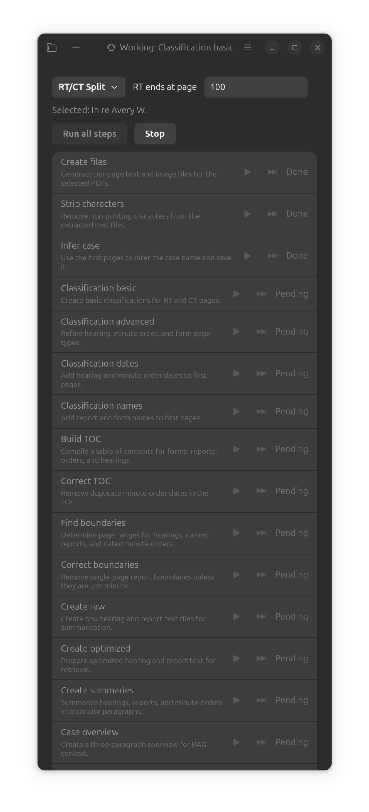

# Record Prep


Record Prep is a GTK4/Libadwaita desktop app that turns OCR'd legal transcript PDFs into a structured
case bundle with classifications, summaries, and retrieval-ready artifacts for appellate workflows.

## Current state
- Functional GTK4/Libadwaita desktop UI with the full pipeline exposed as step-by-step actions.
- Pipeline implementation and settings UI live in a single entry point (`recordprep.py`).
- Settings are stored in `config.json` and cover API URLs, model IDs, keys, and prompts.
- Local OCR defaults to a llama.cpp server, while remote steps use configurable API providers.
- RAG output targets VoyageAI or Isaacus embeddings with a Chroma vector store.

## What it does
- Imports one or more PDFs (merged in natural sort order).
- Extracts per-page text and grayscale page images.
- Classifies pages, adds dates/names, and builds a table of contents.
- Finds hearing/report/minute order boundaries.
- Generates raw and optimized text, summaries, and a case overview.
- Optionally builds a VoyageAI/Chroma or Isaacus/Chroma RAG index from optimized hearing/report content.



## Requirements
- Python 3.13+
- GTK4/Libadwaita (via `pygobject`)
- `pdftotext` Python bindings, PyMuPDF, PyPDF, LangChain + Chroma + VoyageAI/Isaacus (for RAG)

## Recommended models
- OCR model: LightOnOCR-2-1B-Q8_0.gguf via llama.cpp
- Vision model: qwen3-vl-235b-a22b-instruct via Fireworks API
- Optimize model: llama-3.3-70b via Cerebras API
- Summarization model: deepseek-v3p1 via Fireworks API
- Embeddings model: voyage-law-2 via Voyage API or kanon-2-embedder via Isaacus API

## Quick start
```bash
uv run recordprep.py
```

## Using the app
1. Click the folder button to choose an existing `case_bundle` folder or its parent directory.
2. Click the list-add button to select one or more PDFs from the same folder.
3. Run individual steps or click "Run all steps".
4. Use the menu button to open Settings and configure API endpoints, models, keys, and prompts.
5. Use the menu button to open "Test Classification" for a single-image prompt run with a live preview.

## Output layout
A `case_bundle/` folder is created next to the selected PDFs (or reused if already present):
```
case_bundle/
  case_name.txt
  manifest.json
  text_pages/           # 0001.txt, 0002.txt, ...
  image_pages/          # 0001.png, 0002.png, ... (300 DPI grayscale)
  classification/       # basic.jsonl, basic_corrected.jsonl, ...
  artifacts/            # toc.txt, boundary json, raw/optimized text
  summaries/            # hearings_sum_<case>.txt, reports_sum_<case>.txt, minutes_sum_<case>.txt (or summarized_*.txt)
  rag/                  # case_overview.txt, vector_database/
  temp/                 # merged.pdf (when multiple PDFs are selected)
```

## Pipeline steps
- Create files: generate `text_pages/` and `image_pages/` and merge PDFs when needed.
- Strip characters: remove non-printing characters from extracted text.
- Infer case: derive the case name from the first pages and save `case_name.txt`.
- Classification basic: classify every page into major page types.
- Correct basic classification: fix common page-type gaps.
- Advanced classification: mark hearing, minute, and form first pages.
- Correct advanced classification: when two `RT_body_first_page` markers are consecutive, keep the first and convert the second to `RT_body`.
- Classification dates: add hearing and minute order dates (vision model on page images).
- Classification names: add report and form names (vision model on page images).
- Build TOC: generate `artifacts/toc.txt`.
- Correct TOC: remove duplicate minute order dates.
- Find boundaries: write hearing/report/minute boundaries JSON.
- Create raw: compile raw hearing and report text files.
- Create optimized: LLM-reformat text for retrieval.
- Create summaries: generate hearing/report/minute summaries (case-named when available).
- Case overview: create a three-paragraph RAG overview.
- Create RAG index: build a VoyageAI/Chroma or Isaacus/Chroma vector store.

## Settings
Settings are stored in `config.json` next to `recordprep.py` and include API URLs, model IDs,
keys, and prompts for each LLM-backed step.

## License
GPL-3.0-or-later. See `LICENSE`.
